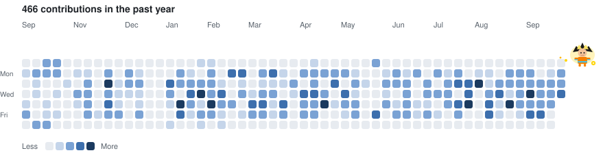

# Husne Shabbir

**Associate Software Quality Engineer at Red Hat** · Bangalore, India

I build the quality layer for [Red Hat Developer Hub](https://developers.redhat.com/rhdh): Backstage plugin coverage, Playwright end-to-end suites, GitOps CI, and evaluation of LLM-backed features.

[GitHub](https://github.com/HusneShabbir) · [Merged pull requests](https://github.com/search?q=author%3AHusneShabbir+is%3Apr+is%3Amerged&type=pullrequests) · [Open pull requests](https://github.com/search?q=author%3AHusneShabbir+is%3Apr+is%3Aopen&type=pullrequests)

## What I work on

Quality engineering for an internal developer portal built on Backstage. Coverage runs from plugin unit and integration tests through product end-to-end flows and the CI that executes them on Kubernetes.

| Area | What I cover |
| --- | --- |
| Intelligent Assistant and Lightspeed | Notebooks, saved prompts, screen context, RBAC, bring-your-own-key RAG |
| Model Context Protocol | Kubernetes actions, orchestrator, scorecard tools, dynamic client registration |
| Catalog and platform plugins | Boost, OGX entity provider, KServe / Kubeflow connector, scorecard, homepage |
| Delivery | GitHub Actions, Kind, GitOps for the AI rolling demo, flake reduction |
| LLM evaluation | RAG relevancy, faithfulness, bias, and hallucination with DeepEval |

## Open source

**111 merged pull requests.** **68** of those landed in [redhat-developer](https://github.com/redhat-developer), with more merged in Backstage community plugins, the RHDH AI rolling demo, and the automation-coverage MCP.

| Project | Merged | Focus |
| --- | ---: | --- |
| [redhat-developer/rhdh-plugins](https://github.com/redhat-developer/rhdh-plugins) | 46 | Playwright, integration, and permission coverage for Developer Hub plugins |
| [redhat-developer/rhdh](https://github.com/redhat-developer/rhdh) | 14 | Showcase end-to-end tests for scorecard, catalog, and adoption insights |
| [redhat-developer/rhdh-plugin-export-overlays](https://github.com/redhat-developer/rhdh-plugin-export-overlays) | 8 | Lightspeed, Intelligent Assistant, scorecard, and homepage e2e |
| [redhat-ai-dev/ai-rolling-demo-gitops](https://github.com/redhat-ai-dev/ai-rolling-demo-gitops) | 5 | GitOps CI, KServe connector coverage, Playwright TypeScript migration |
| [backstage/community-plugins](https://github.com/backstage/community-plugins) | 3 | Topology and ACR end-to-end tests, including i18n |
| [rhdh-pai-qe/automation-coverage-mcp](https://github.com/rhdh-pai-qe/automation-coverage-mcp) | 2 | Jira-driven automation planning and Feature-to-QE ticket breakdown |

Further merged pull requests sit on collaborator forks of these same repositories, usually while a change is in review.

### Selected work

- [Topology e2e tests](https://github.com/backstage/community-plugins/pull/6344) and [ACR e2e tests with i18n](https://github.com/backstage/community-plugins/pull/6365) in Backstage community plugins
- [Notebook Release 2.1 e2e coverage](https://github.com/redhat-developer/rhdh-plugins/pull/4551) and [RBAC permission integration tests](https://github.com/redhat-developer/rhdh-plugins/pull/4693) for Intelligent Assistant
- [Kubernetes MCP actions coverage](https://github.com/redhat-developer/rhdh-plugins/pull/4549) and [Boost catalog coverage](https://github.com/redhat-developer/rhdh-plugins/pull/4501)
- [Lightspeed e2e workspace](https://github.com/redhat-developer/rhdh-plugin-export-overlays/pull/2453) and [notebook e2e coverage](https://github.com/redhat-developer/rhdh-plugin-export-overlays/pull/2605)
- [Playwright TypeScript migration](https://github.com/redhat-ai-dev/ai-rolling-demo-gitops/pull/287) and [KServe / Kubeflow connector e2e](https://github.com/redhat-ai-dev/ai-rolling-demo-gitops/pull/339)
- [Jira MCP integration](https://github.com/rhdh-pai-qe/automation-coverage-mcp/pull/2) and the [Feature-to-QE ticket planner](https://github.com/rhdh-pai-qe/automation-coverage-mcp/pull/3)

## Stack

  
  
  
  
  
  

  
  
  
  
  
  

Playwright in TypeScript and Python · React Testing Library · Backstage `startTestBackend` · DeepEval · Model Context Protocol · OpenShift · GitOps

## Projects

**[rhdh-Lightspeed-Evaluation](https://github.com/HusneShabbir/rhdh-Lightspeed-Evaluation)**
Automated evaluation of RAG answers from Developer Hub Lightspeed. Checks relevancy, faithfulness, bias, and hallucination, with a local Ollama model as the judge.

**[DeepEval learnings](https://github.com/HusneShabbir/LLMEvaluation_Deepeval_Learnings)**
Notes and experiments on testing LLM applications with DeepEval.

**[automation-coverage-mcp](https://github.com/rhdh-pai-qe/automation-coverage-mcp)**
Coverage-driven test planning for RHDH plugin forests, including a Jira integration that turns a Feature into the cheapest useful test layer.

## GitHub activity

<picture>
  <source media="(prefers-color-scheme: dark)" srcset="./assets/contributions-dark.svg" />
  
</picture>

 

<picture>
  <source media="(prefers-color-scheme: dark)" srcset="https://github-readme-stats.vercel.app/api?username=HusneShabbir&show_icons=true&hide_border=true&theme=tokyonight&rank_icon=percentile&include_all_commits=true" />
  
</picture>
&nbsp;
<picture>
  <source media="(prefers-color-scheme: dark)" srcset="https://github-readme-stats.vercel.app/api/top-langs/?username=HusneShabbir&layout=compact&hide_border=true&theme=tokyonight&langs_count=6&include_all_commits=true" />
  
</picture>

 

<picture>
  <source media="(prefers-color-scheme: dark)" srcset="https://streak-stats.demolab.com?user=HusneShabbir&hide_border=true&theme=tokyonight" />
  
</picture>

